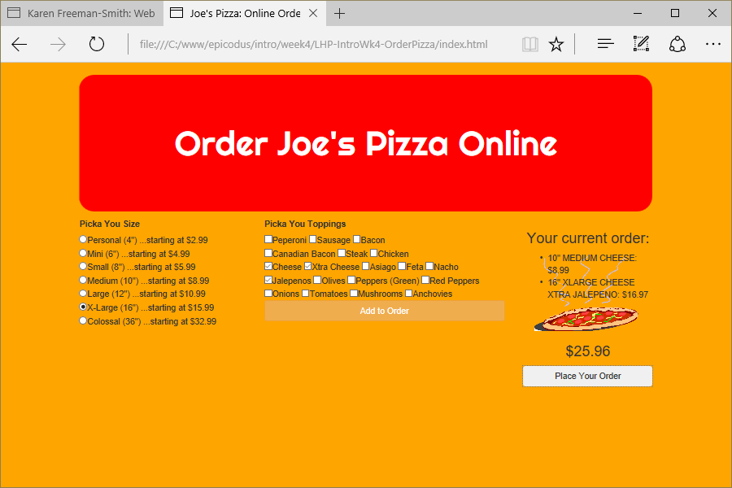

# Joe's Pizza
Version 0.0.1: May 9, 2016
by [Karen Freeman-Smith](https://karenfreemansmith.github.io)

### Technologies Used
HTML, CSS, Bootstrap, JavaScript, jQuery

## Description
*[Learn How To Program](http://learnhowtoprogram.com) Intro to Programming Week 4 Individual Project: A website that lets you order some pizza and calculates the cost of your order.*

## Setup/Installation
* [View on Github Pages](https://karenfreemansmith.github.io/LHP-IntroWk4-OrderPizza)
* _OR_
* Clone directory
* Open index.html in your favorite browser

## Support & Contact
For questions, concerns, or suggestions please email karenfreemansmith@gmail.com

## Specifications
* Allow the user to choose toppings and size for the pizza they'd like to order.
* Create a pizza object constructor with properties for toppings and size.
* Create a prototype method for the cost of a pizza depending on the selections chosen. Use your own formula for this.

## Known Issues
* None

## Legal
*Licensed under the GNU General Public License v3.0*

Copyright (c) 2016 Copyright _[Karen Freeman-Smith](https://karenfreemansmith.github.io)_ All Rights Reserved.
